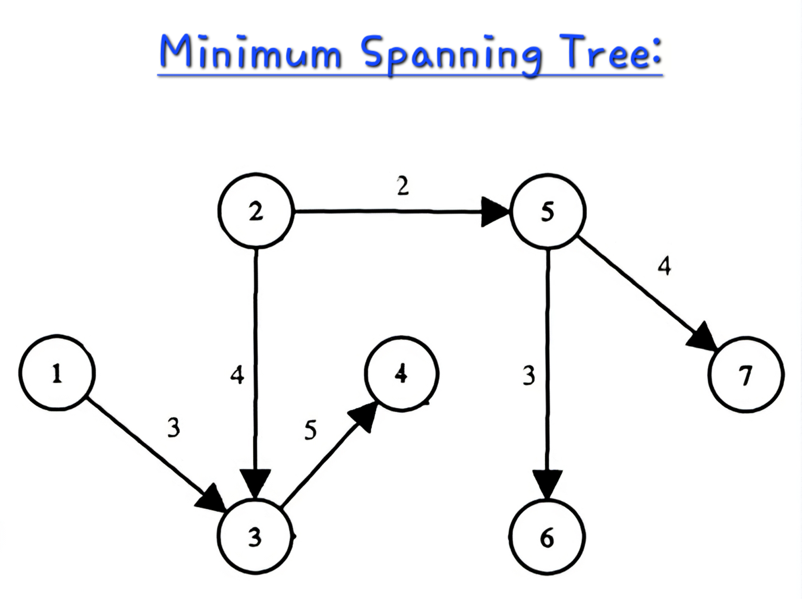

# Minimum Spanning Tree using Kruskal's Algorithm

This C++ program implements Kruskal's algorithm to find the Minimum Spanning Tree (MST) of a given undirected weighted graph containing function to implement Kruskal's algorithm that accepts an adjacency matrix as input.

## Input Format

The input consists of two lines:

1. The first line contains an integer `N`, representing the number of vertices in the graph.
2. The second line contains an integer `M`, representing the number of edges in the graph.
3. The following `M` lines each contain three space-separated integers: `u v w`, representing an edge between vertices `u` and `v` with weight `w`.

## Output Format

The program outputs the edges of the Minimum Spanning Tree along with their weights. Each line represents an edge in the MST, with the format:
<source_vertex>--<destination_vertex> Weight: <weight>

### Sample Input:
```
7
12
1 2 5
1 3 3
2 3 4
2 4 6
3 4 5
2 5 2
4 5 6
3 6 6
4 6 6
5 6 3
5 7 4
6 7 4
```

### Sample Output

```
2--5 Weight: 2
5--6 Weight: 3
1--3 Weight: 3
2--3 Weight: 4
5--7 Weight: 4
3--4 Weight: 5
```

<div style="display: flex;">
    
    
</div>

In this example, the MST contains 6 edges.